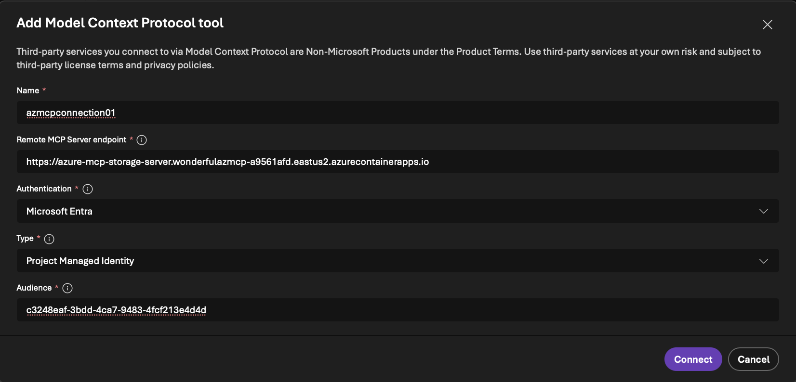

# Azure MCP Server - ACA with Managed Identity

This template deploys the [Azure MCP Server 2.0-beta](https://mcr.microsoft.com/product/azure-sdk/azure-mcp) as a remote MCP server on Azure Container Apps, accessible over HTTPS. It enables AI agents from [Microsoft Foundry](https://azure.microsoft.com/products/ai-foundry) and [Microsoft Copilot Studio](https://www.microsoft.com/microsoft-copilot/microsoft-copilot-studio) to securely invoke MCP tool calls that perform Azure operations on your behalf.

The server is configured with three MCP namespaces: **storage**, **advisor**, and **compute**.

## Prerequisites

- Azure subscription with **Owner** or **User Access Administrator** permissions
- [Azure Developer CLI (azd)](https://learn.microsoft.com/azure/developer/azure-developer-cli/install-azd)
- [Azure CLI](https://learn.microsoft.com/cli/azure/install-azure-cli) (for post-deployment role assignments)

## Architecture Diagram
┌──────────────────────────────────────┐
│ Microsoft Foundry / Copilot Studio   │
│ AI Agents                            │
└───────────────┬──────────────────────┘
                │ HTTPS (MCP Protocol)
                ▼
┌──────────────────────────────────────┐
│ Azure MCP Server (2.0‑beta)          │
│ Azure Container App                  │
│ - storage namespace                 │
│ - advisor namespace                 │
│ - compute namespace                 │
└───────────────┬──────────────────────┘
                │ Managed Identity (RBAC)
                ▼
┌──────────────────────────────────────┐
│ Azure Control Plane                  │
│  • Azure Advisor                    │
│  • Azure Compute (VMs)              │
│  • Azure Storage Accounts           │
└──────────────────────────────────────┘

(Optional)
┌──────────────────────────────────────┐
│ Application Insights                │
│ Telemetry & diagnostics             │
└──────────────────────────────────────┘

## Quick Start

### 1. Initialize and configure

```bash
azd init -t azmcp-foundry-aca-mi
```

Set required environment variables:

```bash
azd env set STORAGE_RESOURCE_ID "/subscriptions/<sub-id>/resourceGroups/<rg>/providers/Microsoft.Storage/storageAccounts/<account>"
azd env set FOUNDRY_PROJECT_RESOURCE_ID "/subscriptions/<sub-id>/resourceGroups/<rg>/providers/Microsoft.CognitiveServices/accounts/<account>/projects/<project>"
azd env set VM_RESOURCE_GROUP_NAME "<resource-group-with-vms>"
azd env set ADVISOR_RESOURCE_GROUP_NAME "<resource-group-for-advisor>"
```

### 2. Deploy

```bash
azd up
```

### 3. (Optional) Grant subscription-level Reader for full Advisor details

The resource-group-scoped Reader role allows listing recommendations, but full recommendation details require subscription-level access:

```bash
principalId=$(az containerapp show --name azure-mcp-storage-server --resource-group <rg> --query "identity.principalId" -o tsv)
az role assignment create --assignee $principalId --role "Reader" --scope "/subscriptions/<sub-id>"
```

## What Gets Deployed

| Resource | Description |
|----------|-------------|
| **Container App** | Runs Azure MCP Server (`mcr.microsoft.com/azure-sdk/azure-mcp:latest`) with `storage`, `advisor`, and `compute` namespaces in read-only mode |
| **Container Apps Environment** | Hosting environment with HTTP autoscaling (up to 100 concurrent requests) |
| **Entra App Registration** | OAuth 2.0 auth with `Mcp.Tools.ReadWrite.All` app role and `Mcp.Tools.ReadWrite` delegated scope; VS Code pre-authorized as a client |
| **Foundry Role Assignment** | Grants the Foundry project's managed identity the Entra app role to call the MCP server |
| **Storage Role Assignments** | Container App MI gets **Storage Blob Data Reader** and **Reader** on the target storage account |
| **VM Resource Group Reader** | Container App MI gets **Reader** on the specified VM resource group for compute operations |
| **Advisor Resource Group Reader** | Container App MI gets **Reader** on the specified resource group for Advisor recommendations |
| **Application Insights** | Telemetry and monitoring (disabled by default; set `appInsightsConnectionString` to enable) |

## Parameters

| Parameter | Environment Variable | Description |
|-----------|---------------------|-------------|
| `location` | `AZURE_LOCATION` | Azure region for all resources |
| `acaName` | — | Container App name (default: `azure-mcp-storage-server`) |
| `entraAppDisplayName` | — | Entra App display name (default: `Azure MCP Storage Server API`) |
| `storageResourceId` | `STORAGE_RESOURCE_ID` | Full resource ID of the target storage account |
| `foundryProjectResourceId` | `FOUNDRY_PROJECT_RESOURCE_ID` | Full resource ID of the Microsoft Foundry project |
| `vmResourceGroupName` | `VM_RESOURCE_GROUP_NAME` | Resource group containing VMs for compute access |
| `advisorResourceGroupName` | `ADVISOR_RESOURCE_GROUP_NAME` | Resource group to grant Reader access for Advisor |
| `appInsightsConnectionString` | — | Set to `DISABLED` to skip App Insights, empty to create new, or provide an existing connection string |
| `serviceManagementReference` | — | Optional GUID to link the Entra App to a service in Azure |

## Project Structure

```
├── azure.yaml                          # azd project definition
├── README.md
├── infra/
│   ├── bicepconfig.json                # Enables Microsoft Graph Bicep extension
│   ├── main.bicep                      # Main orchestrator template
│   ├── main.parameters.json            # Parameter values (references azd env vars)
│   └── modules/
│       ├── aca-infrastructure.bicep            # Container App + environment
│       ├── aca-role-assignment-resource.bicep  # Cross-RG wrapper for storage role assignments
│       ├── aca-role-assignment-resource-storage.bicep  # Storage-scoped RBAC assignment
│       ├── aca-role-assignment-rg.bicep        # Resource-group-scoped RBAC assignment
│       ├── application-insights.bicep          # Conditional App Insights + Log Analytics
│       ├── entra-app.bicep                     # Entra ID app registration + service principal
│       └── foundry-role-assignment-entraapp.bicep  # Foundry MI → Entra app role grant
```

## Deployment Outputs

After deployment, retrieve outputs with:

```bash
azd env get-values
```

Key outputs:

```
CONTAINER_APP_URL="https://azure-mcp-storage-server.<env>.<region>.azurecontainerapps.io"
ENTRA_APP_CLIENT_ID="<client-id>"
ENTRA_APP_IDENTIFIER_URI="api://<client-id>"
ENTRA_APP_OBJECT_ID="<object-id>"
ENTRA_APP_ROLE_ID="<role-id>"
ENTRA_APP_SERVICE_PRINCIPAL_ID="<sp-id>"
```

## Using Azure MCP Server from Microsoft Foundry Agent

Once deployed, connect your Microsoft Foundry agent to the Azure MCP Server running on Azure Container Apps. The agent will authenticate using its managed identity and gain access to the configured Azure Storage tools.

1. Get your Container App URL from `azd` output: `CONTAINER_APP_URL`
2. Get Entra App Client ID from `azd` output: `ENTRA_APP_CLIENT_ID`
2. Navigate to your Foundry project: https://ai.azure.com/nextgen
3. Go to **Build** → **Create agent**  
4. Select the **+ Add** in the tools section
5. Select the **Custom** tab 
6. Choose **Model Context Protocol** as the tool and click **Create** 
7. Configure the MCP connection 
   - Enter the `CONTAINER_APP_URL` value as the Remote MCP Server endpoint. 
   - Select **Microsoft Entra** → **Project Managed Identity**  as the authentication method
   - Enter your `ENTRA_APP_CLIENT_ID` as the audience.
   - Click **Connect** to associate this connection to the agent

Your agent is now ready to assist you! It can answer your questions and leverage tools from the Azure MCP Server to perform Azure operations on your behalf.

## Clean Up

```bash
azd down
```

## Template Structure

The `azd` template consists of the following Bicep modules:

- **`main.bicep`** - Orchestrates the deployment of all resources
- **`aca-infrastructure.bicep`** - Deploys Container App and environment hosting the Azure MCP Server with `storage`, `advisor`, and `compute` namespaces
- **`aca-role-assignment-resource.bicep`** - Cross-resource-group wrapper that delegates storage RBAC role assignments
- **`aca-role-assignment-resource-storage.bicep`** - Assigns Azure RBAC roles to the Container App managed identity scoped to a specific storage account
- **`aca-role-assignment-rg.bicep`** - Assigns Azure RBAC roles to the Container App managed identity scoped to a resource group (used for VM and Advisor access)
- **`entra-app.bicep`** - Creates Entra App registration with `Mcp.Tools.ReadWrite.All` app role for OAuth 2.0 authentication
- **`foundry-role-assignment-entraapp.bicep`** - Grants the Foundry project's managed identity the Entra App role for MCP server access
- **`application-insights.bicep`** - Conditionally deploys Application Insights and Log Analytics for telemetry

## Common Errors

### ServiceManagementReference field is required

```json
{ 
  "error": { 
    "code":"BadRequest",
    "target":"/resources/entraApp",
    "message":"ServiceManagementReference field is required for ..."
  }
}
```

This occurs when deploying (`azd up`) an Entra app registration without a `serviceManagementReference`. The Microsoft Graph API requires this field if your organization requires a Service Tree ID that the app should be attributed to.

**Fix:** Pass the GUID via the `serviceManagementReference` parameter. Add it to [infra/main.parameters.json](infra/main.parameters.json):

```json
{
  "parameters": {
    "serviceManagementReference": {
      "value": "<your-guid>"
    }
  }
}
```

Then re-run `azd up`.

