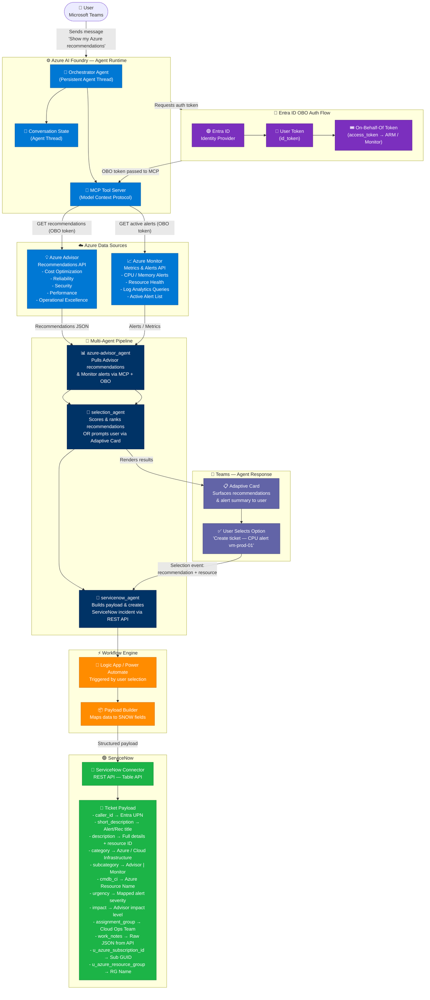

# Azure Advisor Multi-Agent Architecture with ServiceNow Integration

> An intelligent, multi-agent system built on **Azure AI Foundry** that automatically surfaces Azure Advisor recommendations and Azure Monitor alerts in Microsoft Teams, allows users (or an AI agent) to select the best remediation action, and auto-creates a fully enriched **ServiceNow incident ticket** — all secured via **Entra ID On-Behalf-Of (OBO)** authentication.

---

## Table of Contents

1. [Architecture Overview](#architecture-overview)
2. [Mermaid Diagram](#mermaid-diagram)
3. [How It Works — End-to-End Flow](#how-it-works--end-to-end-flow)
4. [Agent Descriptions](#agent-descriptions)
   - [azure-advisor_agent](#1-azure-advisor_agent)
   - [selection_agent](#2-selection_agent)
   - [servicenow_agent](#3-servicenow_agent)
5. [Authentication — Entra ID OBO Flow](#authentication--entra-id-obo-flow)
6. [ServiceNow Ticket Payload Mapping](#servicenow-ticket-payload-mapping)
7. [Technologies Used](#technologies-used)
8. [Prerequisites & Getting Started](#prerequisites--getting-started)

---

## Architecture Overview

This solution uses three coordinated AI agents hosted in **Azure AI Foundry**, connected to Microsoft Teams via **Azure Bot Service**, and secured through **Microsoft Entra ID**. The agents use the **Model Context Protocol (MCP)** as the tool interface to query Azure APIs using delegated user permissions — ensuring all data is scoped to what the authenticated user has access to.

```
User (Teams) → Foundry Agent Runtime → azure-advisor_agent (data pull)
                                      → selection_agent (recommendation scoring / user input)
                                      → servicenow_agent (ticket creation)
```

---

## Mermaid Diagram



---

## How It Works — End-to-End Flow

### Step 1 — User Initiates in Microsoft Teams
The user opens a chat with the AI agent in Microsoft Teams and sends a message such as:
> *"Show me my Azure recommendations"* or *"What alerts are active in my subscription?"*

The message is routed through **Azure Bot Service** to the **Azure AI Foundry Agent Runtime**, which maintains a persistent conversation thread per user session.

### Step 2 — Authentication via Entra ID OBO
Before any Azure API calls are made, the **Foundry Agent** triggers the **Entra ID On-Behalf-Of (OBO)** flow:
1. Teams provides the user's identity token.
2. The OBO flow exchanges this for an **access token scoped to Azure Resource Manager (ARM)** and **Azure Monitor APIs**.
3. All downstream API calls are made on behalf of the **authenticated user**, respecting their RBAC permissions.

### Step 3 — azure-advisor_agent Pulls Data
The `azure-advisor_agent` is invoked via the **MCP Tool Server**. It calls:
- **Azure Advisor REST API** → retrieves cost, reliability, security, performance, and operational excellence recommendations.
- **Azure Monitor REST API** → retrieves active metric alerts, resource health events, and Log Analytics query results.

All results are scoped to the user's accessible subscriptions and resource groups.

### Step 4 — selection_agent Scores & Presents Options
The `selection_agent` receives the raw data and performs:
1. **Automatic scoring**: Ranks recommendations by severity, impact level (High/Medium/Low), and affected resource criticality.
2. **Best recommendation selection**: Can autonomously pick the top action if configured for auto-remediation.
3. **User prompt (interactive mode)**: Renders a **Teams Adaptive Card** listing the top recommendations and alerts, asking the user to select which one to act on.

### Step 5 — servicenow_agent Creates the Ticket
Once a selection is made (by the user or autonomously), the `servicenow_agent`:
1. Builds a fully enriched **ServiceNow incident payload**.
2. Maps all Azure metadata (subscription ID, resource group, resource name, severity) to ServiceNow fields.
3. Calls the **ServiceNow Table API** via REST connector to create the incident.
4. Returns the **ServiceNow ticket number** to the user in Teams.

---

## Agent Descriptions

### 1. `azure-advisor_agent`

| Property | Details |
|----------|---------|
| **Role** | Data Retrieval Agent |
| **Tool** | MCP Tool Server (Model Context Protocol) |
| **Auth** | Entra ID OBO access token (delegated user permissions) |
| **Inputs** | User identity token, subscription scope |
| **Outputs** | Structured JSON of recommendations + active alerts |

**What it does:**

The `azure-advisor_agent` is the **data ingestion layer** of the pipeline. It authenticates using the user's delegated OBO token and queries two Azure APIs:

- **Azure Advisor Recommendations API** (`/providers/Microsoft.Advisor/recommendations`):
  - Retrieves all active recommendations scoped to accessible subscriptions.
  - Categories: `Cost`, `HighAvailability`, `Security`, `Performance`, `OperationalExcellence`.
  - Captures: recommendation name, impacted resource, impact level (High/Medium/Low), remediation description, potential savings.

- **Azure Monitor Alerts API** (`/providers/Microsoft.AlertsManagement/alerts`):
  - Retrieves active metric alerts and resource health events.
  - Captures: alert name, severity (Sev0–Sev4), affected resource, fired time, alert condition, signal type.

The agent returns a **unified recommendation object** containing both Advisor and Monitor data, tagged with resource metadata (subscription ID, resource group, resource name).

```json
{
  "advisor_recommendations": [
    {
      "id": "/subscriptions/{subId}/...",
      "category": "Performance",
      "impact": "High",
      "impacted_resource": "vm-prod-01",
      "short_description": "CPU overprovisioned — right-size to Standard_B2s",
      "potential_savings": "$142/month",
      "subscription_id": "xxxxxxxx-xxxx-xxxx-xxxx-xxxxxxxxxxxx",
      "resource_group": "rg-production"
    }
  ],
  "monitor_alerts": [
    {
      "id": "/subscriptions/{subId}/...",
      "name": "High CPU Alert — vm-prod-01",
      "severity": "Sev1",
      "resource": "vm-prod-01",
      "fired_time": "2026-03-31T10:15:00Z",
      "condition": "CPU > 90% for 5 min"
    }
  ]
}
```

---

### 2. `selection_agent`

| Property | Details |
|----------|---------|
| **Role** | Recommendation Scoring & Selection Agent |
| **Mode** | Autonomous (auto-select) or Interactive (user prompt via Adaptive Card) |
| **Inputs** | Unified recommendation object from `azure-advisor_agent` |
| **Outputs** | Single selected recommendation + enriched context package |

**What it does:**

The `selection_agent` is the **intelligence and decision layer**. It receives the full list of recommendations and alerts and performs the following:

**Auto-Scoring Logic:**
- Assigns a priority score to each item based on:
  - Severity / Impact level (`High` = 3, `Medium` = 2, `Low` = 1)
  - Alert severity (`Sev0` = 5, `Sev1` = 4, `Sev2` = 3, `Sev3` = 2, `Sev4` = 1)
  - Category weight (`Security` > `Reliability` > `Performance` > `Cost` > `Operational Excellence`)
  - Recency of alert or recommendation creation date
- Can autonomously select the **highest priority item** for auto-remediation workflows.

**Interactive Mode (Teams Adaptive Card):**
- Renders recommendations and alerts as a structured **Adaptive Card** in Teams.
- The card shows: resource name, issue description, impact level, category, and a "Create Ticket" action button per item.
- Waits for the user's selection event before proceeding.

**Output Package:**
Once a selection is made, the agent packages:
- The full recommendation/alert object
- The user's Entra UPN (for ticket caller field)
- Resource metadata (subscription ID, resource group, resource name)
- Recommended assignment group mapping based on category
- Urgency/Impact mapping for ServiceNow severity fields

This package is passed directly to the `servicenow_agent`.

---

### 3. `servicenow_agent`

| Property | Details |
|----------|---------|
| **Role** | Ticket Creation Agent |
| **API** | ServiceNow Table API (`/api/now/table/incident`) |
| **Auth** | ServiceNow OAuth 2.0 or Basic Auth (configurable) |
| **Inputs** | Enriched selection package from `selection_agent` |
| **Outputs** | ServiceNow incident number + direct link returned to user in Teams |

**What it does:**

The `servicenow_agent` is the **action and fulfillment layer**. It takes the enriched selection context from `selection_agent` and:

1. **Builds the full ServiceNow incident payload** — mapping every Azure metadata field to the appropriate ServiceNow field (see payload table below).
2. **Calls the ServiceNow Table REST API** via the Logic App / Power Automate connector or direct HTTP action.
3. **Parses the response** to extract the incident number (`INC0012345`) and the direct ticket URL.
4. **Posts a confirmation message** back to the user in Teams with the ticket number and a clickable link to the ServiceNow record.
5. **Optionally updates the agent thread** with the ticket reference for future conversation context (e.g., *"What's the status of my last ticket?"*).

```python
# Example API call
POST https://{instance}.service-now.com/api/now/table/incident
Authorization: Bearer {oauth_token}
Content-Type: application/json

{
  "caller_id": "gaby.barrera@contoso.com",
  "short_description": "High CPU Alert — vm-prod-01",
  "description": "Azure Monitor Sev1 Alert fired at 2026-03-31T10:15:00Z. CPU > 90% for 5 min. Resource: vm-prod-01 in rg-production.",
  "category": "Azure / Cloud Infrastructure",
  "subcategory": "Azure Monitor",
  "cmdb_ci": "vm-prod-01",
  "urgency": "1",
  "impact": "1",
  "assignment_group": "Cloud Ops Team",
  "work_notes": "{raw Azure Monitor JSON alert payload}",
  "u_azure_subscription_id": "xxxxxxxx-xxxx-xxxx-xxxx-xxxxxxxxxxxx",
  "u_azure_resource_group": "rg-production"
}
```

---

## Authentication — Entra ID OBO Flow

The system uses the **OAuth 2.0 On-Behalf-Of (OBO)** flow to ensure all Azure API calls are made using the **authenticated user's delegated permissions**, not a service principal. This ensures:

- Azure Advisor / Monitor data is scoped to subscriptions the **user has RBAC access to**.
- Ticket `caller_id` is automatically populated with the **user's verified Entra UPN**.
- Full audit trail — all actions are traceable to the authenticated user identity.

### OBO Flow Steps

```
1. User authenticates in Teams → Entra ID issues id_token
2. Azure Bot Service / Foundry Agent receives id_token
3. Agent exchanges id_token for OBO access_token
   (scoped to: https://management.azure.com, https://monitor.azure.com)
4. MCP Tool uses OBO access_token to call Azure APIs
5. All API responses are scoped to user's RBAC permissions
```

### Required Entra App Registration Permissions

| Permission | Type | API |
|-----------|------|-----|
| `https://management.azure.com/user_impersonation` | Delegated | Azure Resource Manager |
| `https://monitor.azure.com/user_impersonation` | Delegated | Azure Monitor |
| `User.Read` | Delegated | Microsoft Graph |

---

## ServiceNow Ticket Payload Mapping

| ServiceNow Field | Source | Example Value |
|-----------------|--------|---------------|
| `caller_id` | Entra ID UPN | `gaby.barrera@contoso.com` |
| `short_description` | Alert/Recommendation title | `High CPU Alert — vm-prod-01` |
| `description` | Full alert details + resource ID | `Azure Monitor Sev1 Alert fired at 2026-03-31T10:15:00Z...` |
| `category` | Static / Config | `Azure / Cloud Infrastructure` |
| `subcategory` | MCP tool source | `Azure Advisor` or `Azure Monitor` |
| `cmdb_ci` | Azure Resource Name | `vm-prod-01` |
| `urgency` | Mapped from alert severity | `1` (Critical → Sev0/Sev1), `2` (High), `3` (Medium) |
| `impact` | Advisor impact field | `1` (High), `2` (Medium), `3` (Low) |
| `assignment_group` | Config / category mapping | `Cloud Ops Team` |
| `work_notes` | Raw JSON from Advisor/Monitor API | `{ "id": "/subscriptions/...", ... }` |
| `u_azure_subscription_id` | Parsed from resource ID | `xxxxxxxx-xxxx-xxxx-xxxx-xxxxxxxxxxxx` |
| `u_azure_resource_group` | Parsed from resource ID | `rg-production` |

> **Note:** Fields prefixed with `u_` are custom fields. Verify field names match your ServiceNow instance configuration.

---

## Technologies Used

| Technology | Purpose |
|-----------|---------|
| **Azure AI Foundry** | Agent runtime, orchestration, persistent threads |
| **Model Context Protocol (MCP)** | Tool interface for agent-to-API communication |
| **Microsoft Entra ID** | Identity, OBO authentication, RBAC enforcement |
| **Azure Advisor** | Cloud recommendations (cost, security, performance, reliability) |
| **Azure Monitor** | Metrics alerts, resource health, Log Analytics |
| **Microsoft Teams** | User interface, Adaptive Cards, Bot integration |
| **Azure Bot Service** | Teams ↔ Foundry Agent bridge |
| **Logic Apps / Power Automate** | Workflow orchestration, ServiceNow connector |
| **ServiceNow** | ITSM platform, incident ticket creation via Table API |

---

## Prerequisites & Getting Started

### Prerequisites

- [ ] **Azure Subscription** with Owner or Contributor role
- [ ] **Azure AI Foundry** workspace provisioned
- [ ] **Microsoft Entra ID** App Registration with OBO permissions configured
- [ ] **Azure Bot Service** resource linked to Teams channel
- [ ] **ServiceNow instance** with Table API access and OAuth app configured
- [ ] **Logic App or Power Automate** flow with ServiceNow connector
- [ ] Custom ServiceNow fields: `u_azure_subscription_id`, `u_azure_resource_group`

### Setup Steps

1. **Register Entra ID App** — configure delegated permissions for Azure Management and Monitor APIs; enable OBO flow.
2. **Deploy MCP Tool Server** — host the MCP server (Azure Container App or App Service) with ARM/Monitor API bindings.
3. **Create Foundry Agents** — deploy `azure-advisor_agent`, `selection_agent`, and `servicenow_agent` in Azure AI Foundry Studio.
4. **Configure Azure Bot Service** — connect to Teams channel and point to the Foundry Agent endpoint.
5. **Set up Logic App** — create the ServiceNow ticket creation workflow with the payload mapping defined above.
6. **Test end-to-end** — send *"Show my Azure recommendations"* from Teams and verify ticket creation in ServiceNow.

---

*Generated with Azure AI Foundry Multi-Agent Architecture — March 2026*
